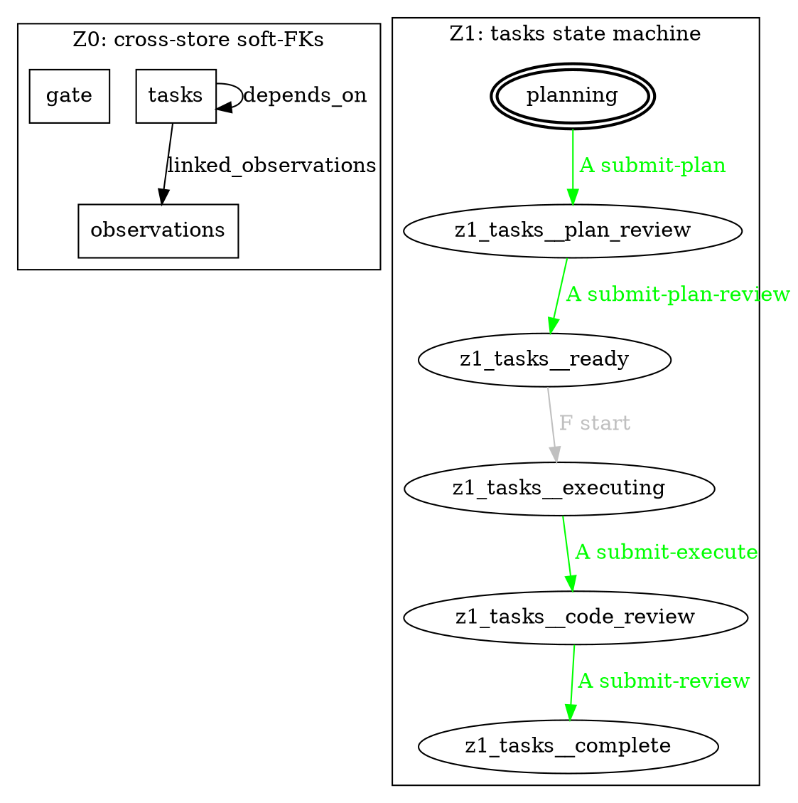

# stores

`stores` is a schema-driven store framework with a single binary CLI. v0.4 ships with three built-in stores (`observations`, `gate`, `tasks`) and a runtime-agnostic workflow orchestrator. Define a YAML schema, `stores install` it, and every field rule (required, enum, pattern, `required_when`, per-field actor authority) is enforced at write time. The `tasks` store adds a full multi-agent workflow engine with state machine, cycle guards, briefing templates, and deterministic main.md rendering.

**v0.4 — schema-validated agent envelope.** Bundled agents are validated via `claude -p --json-schema` (Anthropic SDK structured outputs). When the SDK validates an envelope, drive consumes `result.structured_output` directly. When the agent emits its envelope as prose (markdown-fenced JSON in the assistant text), drive falls back to a Schema-Aligned Parser (BAML-style). Full stream-json transcripts of every spawn are written to `.stores/runs/<session-id>.jsonl` for postmortem.

## Quickstart

```bash
cargo install --path . --features runner-claude-code
stores setup
stores tasks drive --auto --claude-code
```

- `cargo install --path . --features runner-claude-code` — builds and installs the binary with the Claude Code runner enabled. Without `--features runner-claude-code`, only `--mock` is available (useful for testing; `--claude-code` will error at runtime).
- `stores setup` — initialises the local `.stores/` database, installs the `observations`, `gate`, and `tasks` bundled stores, and installs all bundled skills and agent prompts. Idempotent; safe to re-run.
- `stores tasks drive --auto --claude-code` — picks the next non-complete task (by `created_at ASC`), loops `next-action → brief → spawn agent → submit → render` until the task reaches `complete` or `blocked`.

## Spawning a task worktree

The repo ships a `./dev` helper that wraps the two-step "scaffold a task + isolate it in a git worktree" flow so dogfooding stays cheap. See [`CLAUDE.md`](./CLAUDE.md) for the full dogfood doctrine.

```bash
./dev new --slug=my-task --title="my task" --done-when=... --scope-in=... --scope-out=...
# resolves T###, creates ../stores-T###-my-task on feat/T###-my-task,
# adds the substrate row with --invoker ai_with_human, prints the worktree path.

./dev done T### [--force]
# removes the worktree once the substrate row is accepted/rejected
# (use --force to skip the status check); leaves the branch intact.
```

## Key commands

### `stores tasks drive`

Autonomous workflow orchestrator. Drives a task through the full state machine (planning → plan-review → execute/review cycles → complete).

```bash
stores tasks drive --auto --claude-code          # auto-select next task, real claude runner
stores tasks drive T001 --claude-code            # explicit task id
stores tasks drive T001 --mock fixture.jsonl     # mock runner (for tests / CI)
stores tasks drive --auto --claude-code --max-iters 20
```

Exits 0 on `complete` or `blocked` (both are successful outcomes); non-zero on infrastructure errors. On `blocked`, prints a hint: `run stores gate <id> guide`.

### `stores tasks status --follow`

Live observability. Polls the DB and prints workflow state until `complete`, `blocked`, or Ctrl-C.

```bash
stores tasks status --follow T001
stores tasks status --follow        # follows whichever task is active
```

### `stores gate <id> guide`

Human-boundary helper. When a task is `blocked`, builds a curated context bundle (gate row + linked task rows + recent reviews) and spawns a guide agent. The guide agent is authorised to read via `stores gate show`, `stores gate answer`, `stores tasks show`, `stores tasks list`, `stores tasks next-action` — all other `stores` verbs are explicitly forbidden.

```bash
stores gate G001 guide --claude-code
```

Exits 0 if the gate row transitions `pending → answered`; exits 1 otherwise (runner crash, user escape, or agent ran but didn't answer).

### `stores tasks <id> guide`

Context dump + guide agent for a blocked task (stub form; full expansion in v0.4).

```bash
stores tasks T001 guide --claude-code
```

### Runner feature flag

| Feature flag | Available runners | Use case |
|---|---|---|
| *(none, default)* | `--mock` only | Testing, CI, offline |
| `--features runner-claude-code` | `--mock`, `--claude-code` | Production autonomous runs |

The `runner-claude-code` runner requires a recent `claude` CLI (with `--json-schema`, `--session-id`, and `--output-format stream-json --verbose` support). Each spawn writes a JSONL transcript to `.stores/runs/<session-id>.jsonl`; drive logs the parse layer that won (`source=sdk|sap|legacy`) on each submit.

Build for testing only:
```bash
cargo install --path .
stores tasks drive T001 --mock tests/fixtures/drive_e2e/happy_2phase.jsonl
```

Build for production:
```bash
cargo install --path . --features runner-claude-code
stores tasks drive --auto --claude-code
```

### Autonomous flow

`stores agents run` is a long-lived daemon that polls
`transition_history`, gates each candidate dispatch through the policy
layer (`.stores/policies.yaml`), and runs registered subscribers
(`.stores/agents.yaml`). The first builtin subscriber, `accept-merge`,
fast-merges a task's branch into main when it transitions
`in_review → accepted`; conflicts flip the row to `deploy_blocked` and
fire `ntfy`. See [`docs/agents-and-policies.md`](./docs/agents-and-policies.md)
for the full schema reference and runbook.

## Usage

### Topology

`stores topology` prints a static schematic of the installed stores: cross-store soft-FK edges (Z0), per-store state machines (Z1), and the tasks workflow firing order (Z2). Default `--format auto` shells out to `graph-easy --as=boxart` (Debian/Ubuntu pkg `libgraph-easy-perl`) for an in-terminal ASCII render, falling back to raw dot source with a one-line install hint when graph-easy is missing.

```bash
stores topology                         # auto: graph-easy ASCII render, or dot source + hint
stores topology --format dot            # raw graphviz source
stores topology --format mermaid        # stateDiagram-v2 for markdown embedding
stores topology --store tasks           # filter Z1/Z2 to one store; Z0 still shows full graph
stores topology --no-icons              # disable Nerd Font glyphs (text codes A / H+ / H! / F)
```

Representative `--format dot` output (trimmed) for the bundled `observations` / `gate` / `tasks` trio:



Edge labels use a single-letter actor marker (`A` ai_autonomous, `H+` ai_with_human, `H!` human, `F` framework) plus the verb. Colors map to the same actor classes (green / yellow / red / gray); pass `--no-icons` or set `NO_COLOR=1` for plain text codes.

The tasks lifecycle also includes a `deploy_blocked` state reached via `accepted → deploy_blocked` (framework-fired by the autonomous flow engine when accept-merge hits a conflict) and resolvable via `resume` after specialist intervention.

## Install (manual)

```bash
cargo install --path .
stores init
stores install observations    # v0.1 bundled store
stores install gate            # v0.1 bundled store
stores install tasks           # v0.2 workflow store
```

Requires: Rust toolchain (stable). SQLite is bundled via `rusqlite-bundled` — no system SQLite dependency.

## Schema migrations

Run `stores migrate --apply` after every `cargo install` / binary upgrade
until the L010 daemon-subscriber automates it. The verb diffs the live
`.stores/db.sqlite` schema against the substrate's compiled-in
`schema.yaml` for every installed store and brings the DB up to the new
binary's expectations.

```bash
cargo install --path .       # upgrade the binary
stores migrate               # DRY-RUN: print the SQL that would execute
stores migrate --apply       # run the SQL inside a single transaction
```

Default mode is DRY-RUN: `stores migrate` prints the `ALTER TABLE …
ADD COLUMN …` statements it would run and exits 0 with no DB changes.
`stores migrate --apply` executes those statements inside a single
transaction; partial failures roll back cleanly.

**Additive-only.** `stores migrate` only emits `ADD COLUMN`. Destructive
changes are deliberately out of scope:

- Columns present in the DB but absent from `schema.yaml` are reported on
  stderr as `orphaned column; not auto-dropped` and skipped.
- Columns present in both with different types are reported on stderr as
  a type mismatch and skipped — no auto-coercion.

**Idempotent.** Running `stores migrate` against an already-in-sync DB is
a clean no-op (exit 0, no SQL emitted, no warnings). Running
`stores migrate --apply` twice in a row produces the same result as
running it once.

## Manual workflow walk-through

Run these commands in any empty directory. Each step closes a numbered verification point.

**Step 1** — Initialize the store database and manifest.

```bash
stores init
```

Creates `.stores/db.sqlite` (SQLite 3, WAL mode) and `.stores/manifest.yaml` in the current directory.

**Step 2** — Install the bundled `observations` store.

```bash
stores install ./stores/observations
```

Generates and applies the DDL for the `observations` table.

**Step 3** — Install the bundled `gate` store (proves multi-store coexistence in one DB).

```bash
stores install ./stores/gate
```

Both `observations` and `gate` tables now live in `.stores/db.sqlite`.

**Step 4** — Add an observation. Returns `L001`.

```bash
stores observations add --summary "thing broke" \
    --source dev --priority normal \
    --captured-at 2026-04-30 --captured-week w11-d4
```

**Step 5** — Flip `intent_contract.contract_state` to `ready` without the required sub-fields. **Fails** — the `required_when: intent_contract.contract_state == 'ready'` rule fires on all gated sub-fields.

```bash
stores observations update L001 --contract-state ready --invoker human
```

Expected error (all violations in one pass):
```
Error: validation failed:
- intent_contract.objective: required (because intent_contract.contract_state == 'ready')
- intent_contract.type: required (because intent_contract.contract_state == 'ready')
- intent_contract.acceptance: required (because intent_contract.contract_state == 'ready')
- intent_contract.in_scope: required (because intent_contract.contract_state == 'ready')
- intent_contract.out_of_scope: required (because intent_contract.contract_state == 'ready')
- intent_contract.tier_hint: required (because intent_contract.contract_state == 'ready')
- intent_contract.approved_by: required (because intent_contract.contract_state == 'ready')
- intent_contract.approved_at: required (because intent_contract.contract_state == 'ready')
```

**Step 6** — Walk through the ratify flow: investigate, fill the contract, confirm.

```bash
stores observations investigate L001 --invoker human
stores observations update L001 \
    --contract-state ready \
    --objective "Fix the 500 handler" \
    --type work \
    --in-scope "backend handler" \
    --out-of-scope "frontend" \
    --acceptance "checkout succeeds" \
    --tier-hint T3 \
    --approved-by blake \
    --approved-at 2026-04-30 \
    --invoker human
stores observations confirm L001 --invoker human
```

**Step 7** — Show L001. Entry includes the populated `intent_contract` record.

```bash
stores observations show L001
```

Add `--json` for machine-readable output with fully nested objects (not escaped strings).

**Step 8** — List all observations.

```bash
stores observations list
```

Add `--json` for a JSON array.

**Step 9** — Add a gate decision linked to L001. Returns `G001`. (`task_ref = L001` makes the cross-store JOIN in step 12 return a real match.)

```bash
stores gate add --type decision \
    --one-liner "Soft or hard delete on cleanup?" \
    --options "soft|hard" \
    --task-ref L001 \
    --filed-by quickstart \
    --source dev
```

**Step 10** — Answer the gate as a human. The `answer` field carries `actor: human`; `--invoker human` satisfies the constraint.

```bash
stores gate answer G001 --answer hard --invoker human
```

**Step 11** — Demonstrate actor-mismatch rejection. G001 is already answered, so we add G002 as a fresh pending gate, then attempt to answer it as `ai_autonomous` (auto-detected from `$CLAUDECODE`).

```bash
CLAUDECODE=1 stores gate add --type decision \
    --one-liner "Actor check demo gate" \
    --options "yes|no" \
    --filed-by quickstart \
    --source dev
```

This returns `G002`. Now attempt to answer without `--invoker`:

```bash
CLAUDECODE=1 stores gate answer G002 --answer hard
```

**Fails** — expected error citing the field and required actor:
```
Error: validation failed:
- <transition:answer>: transition 'answer' requires actor 'human'; invoker is 'ai_autonomous'
  (auto-detected from $CLAUDECODE; pass --invoker human to override if appropriate)
- answer: field 'answer' requires actor 'human'; invoker is 'ai_autonomous'
  (auto-detected from $CLAUDECODE; pass --invoker human to override if appropriate)
```

The `--invoker human` override clears it:

```bash
stores gate answer G002 --answer yes --invoker human
```

**Step 12** — Cross-store SQL JOIN in the single DB. Returns a row with non-NULL `g.display_id` (`G001`) joined to observation `L001` via `task_ref`.

```bash
sqlite3 .stores/db.sqlite \
  "select o.display_id, o.status, json_extract(o.intent_contract,'$.tier_hint'), g.display_id \
   from observations o left join gate g on g.task_ref = o.display_id"
```

Expected output: `L001|confirmed|T3|G001`

**Step 13** — Invoker resolution is demonstrated throughout:
- No `--invoker` + `$CLAUDECODE=1` → `ai_autonomous` (auto-detected)
- No `--invoker` + no `$CLAUDECODE` → `human` (default)
- `--invoker human|ai_autonomous|ai_with_human` → explicit override
- Writes whose actor does not match the field's `actor:` constraint are rejected with the field name, required actor, and detection source in the error.

## What this demonstrates

Two key enforcement moments:

**Required-when contract (#5 / #6):** The `intent_contract` record sub-fields (`objective`, `type`, `acceptance`, `in_scope`, `out_of_scope`, `tier_hint`, `approved_by`, `approved_at`) each carry `required_when: "intent_contract.contract_state == 'ready'"`. Flipping the contract to `ready` without them fails with all violations aggregated in one error. All must be supplied together. This models the "work item needs a clear definition of done before AI takes it on" pattern.

**Per-field actor on `gate.answer` (#10 / #11):** The `answer` field in the `gate` schema carries `actor: human`. An AI invoker (auto-detected from `$CLAUDECODE`) attempting to write it is rejected with a message naming the field, the required actor, and the `$CLAUDECODE` detection source. The `--invoker human` flag overrides the auto-detection for cases where a human is running the CLI in an AI-flagged environment.

## Where the data lives

Everything lives in `.stores/db.sqlite` in the working directory. Both tables are visible:

```bash
sqlite3 .stores/db.sqlite ".tables"
# gate  observations

sqlite3 .stores/db.sqlite ".schema observations"
sqlite3 .stores/db.sqlite ".schema gate"
```

The `manifest.yaml` at `.stores/manifest.yaml` records installed stores with their schema path and install timestamp.

## How to test

```bash
# Run all unit tests
cargo test --all

# Also run with the claude-code runner feature (additional runner tests)
cargo test --features runner-claude-code

# Run the v0.1 13-step demo (observations + gate)
bash tests/e2e.sh

# Run the tasks workflow smoke test (full lifecycle: plan → revise → BLOCKED → resume → complete)
bash tests/tasks_e2e.sh

# Run the drive orchestrator e2e (mock-runner: happy 2-phase + revise-once)
bash tests/drive_e2e.sh
```

All e2e scripts require the `stores` binary on `PATH`. Run `cargo install --path .` first.

## Workflow stores

The `tasks` store ships as a bundled workflow store (`stores list-installable`):

```bash
stores install tasks
stores tasks add --title "My task" --slug "my-task" --done-when "..." --scope-in "..." --scope-out "..."
stores tasks next-action T001 --json   # which agent acts next?
stores tasks brief T001               # get the agent's briefing
stores tasks submit-plan T001 --plan-from-file plan.json
stores tasks submit-plan-review T001 --gate READY --summary "approved"
stores tasks submit-execute T001 --summary "done" --commit abc --files-changed "f.rs"
stores tasks submit-review T001 --gate PASS --critical 0 --major 0 --minor 0 --summary "ok"
stores tasks render T001              # write tasks/active/T001-slug/main.md from DB
```

The `tasks:start` skill (`stores skills install tasks:start`) wraps `stores tasks drive --auto --claude-code` for users who prefer the `/tasks:start` invocation surface.

## Next steps / not in v0.3

- **Provenance log (`runs` store)** — per-operation log for AI audit trails
- **Schema migrations** — `stores upgrade` to apply schema changes to existing tables
- **`ask_user` integration** — block transitions on human confirmation via `pi-ask-user`
- **Cross-repo identity** — shared `display_id` namespace across repos
- **Distribution** — `cargo install --git <url>`; published to crates.io
- **Store templates** — `stores new <name>` scaffolds a schema from a template
- **HTTP API** — JSON over HTTP for tool-use integration
- **Reserved-column-name install check** — install-time rejection when a user field name collides with a reserved column (`status`, `display_id`, `created_at`, etc.)
