# Store Flow Diagrams

These diagrams summarize the runtime flow visible in `src/` and the bundled store schemas.

> Architecture note: task-engine lifecycle/integration direction is now captured in
> `docs/adr/0001-task-engine-lifecycle-and-integration.md` and
> `docs/task-engine-architecture.md`. The "Simplified Proposal" section below is
> historical scratch/context; the ADR is the source of truth for task lifecycle,
> active/integration steps, `task_reviewer`, blocker overlays, and resource-lock
> integration semantics.

## Big Picture

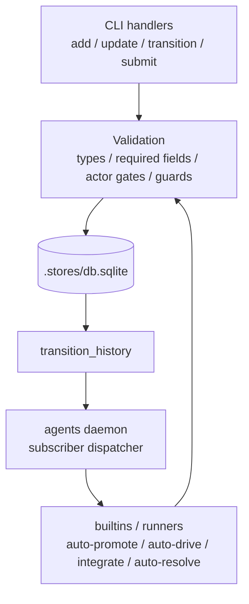
```mermaid
flowchart TD
    CLI[CLI handlers<br/>add / update / transition / submit]
    VALIDATE[Validation<br/>types / required fields / actor gates / guards]
    DB[(.stores/db.sqlite)]
    HISTORY[transition_history]
    DAEMON[agents daemon<br/>subscriber dispatcher]
    BUILTINS[builtins / runners<br/>auto-promote / auto-drive / integrate / auto-resolve]

    CLI --> VALIDATE --> DB
    DB --> HISTORY
    HISTORY --> DAEMON
    DAEMON --> BUILTINS
    BUILTINS --> VALIDATE
```

## Store Map

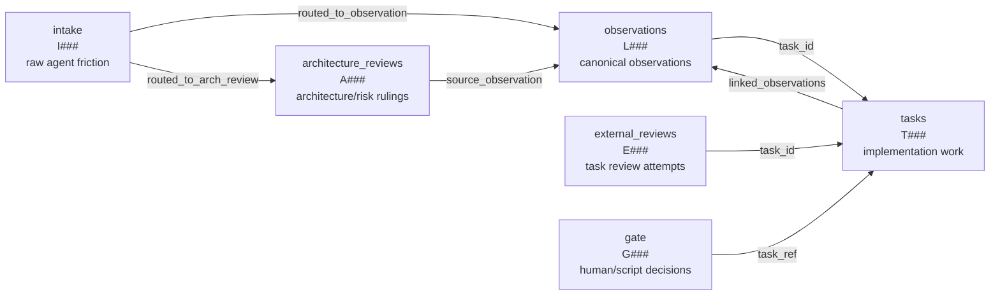
```mermaid
flowchart LR
    INTAKE[intake<br/>I###<br/>raw agent friction]
    OBS[observations<br/>L###<br/>canonical observations]
    ARCH[architecture_reviews<br/>A###<br/>architecture/risk rulings]
    TASKS[tasks<br/>T###<br/>implementation work]
    EXT[external_reviews<br/>E###<br/>task review attempts]
    GATE[gate<br/>G###<br/>human/script decisions]

    INTAKE -- routed_to_observation --> OBS
    INTAKE -- routed_to_arch_review --> ARCH
    OBS -- task_id --> TASKS
    TASKS -- linked_observations --> OBS
    ARCH -- source_observation --> OBS
    EXT -- task_id --> TASKS
    GATE -- task_ref --> TASKS
```

## Filing Paths

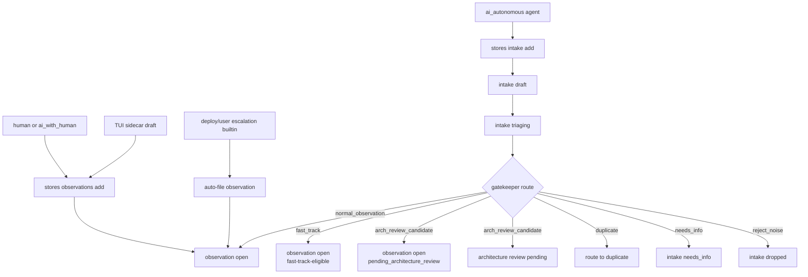
```mermaid
flowchart TD
    HUMAN[human or ai_with_human]
    AUTO[ai_autonomous agent]
    TUI[TUI sidecar draft]
    DEPLOY[deploy/user escalation builtin]

    HUMAN --> DIRECT[stores observations add]
    TUI --> DIRECT
    AUTO --> INTAKE_ADD[stores intake add]
    DEPLOY --> AUTOBS[auto-file observation]

    INTAKE_ADD --> I_DRAFT[intake draft]
    I_DRAFT --> I_TRIAGE[intake triaging]
    I_TRIAGE --> ROUTE{gatekeeper route}

    ROUTE -- normal_observation --> OBS_OPEN[observation open]
    ROUTE -- fast_track --> OBS_FAST[observation open<br/>fast-track-eligible]
    ROUTE -- arch_review_candidate --> OBS_ARCH[observation open<br/>pending_architecture_review]
    ROUTE -- arch_review_candidate --> ARCH_PENDING[architecture review pending]
    ROUTE -- duplicate --> DUP[route to duplicate]
    ROUTE -- needs_info --> NEEDS_INFO[intake needs_info]
    ROUTE -- reject_noise --> DROPPED[intake dropped]

    DIRECT --> OBS_OPEN
    AUTOBS --> OBS_OPEN
```

## Intake Routing

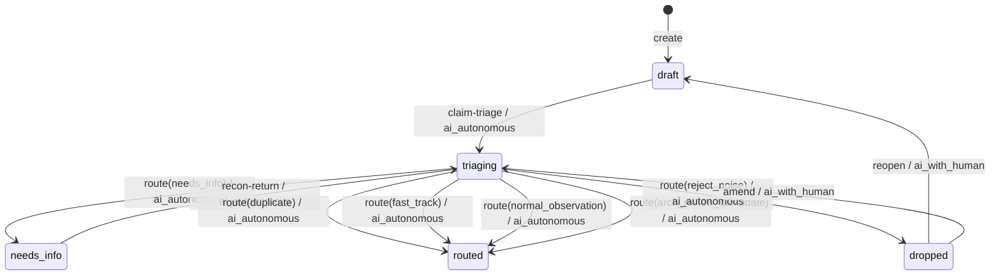
```mermaid
stateDiagram-v2
    [*] --> draft: create
    draft --> triaging: claim-triage / ai_autonomous

    triaging --> needs_info: route(needs_info) / ai_autonomous
    needs_info --> triaging: recon-return / ai_autonomous

    triaging --> routed: route(duplicate) / ai_autonomous
    triaging --> routed: route(fast_track) / ai_autonomous
    triaging --> routed: route(normal_observation) / ai_autonomous
    triaging --> routed: route(arch_review_candidate) / ai_autonomous
    triaging --> dropped: route(reject_noise) / ai_autonomous

    dropped --> draft: reopen / ai_with_human
    dropped --> triaging: amend / ai_with_human
```

## Observation Lifecycle

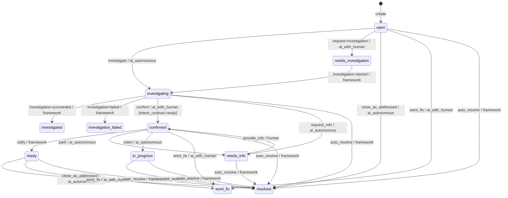
```mermaid
stateDiagram-v2
    [*] --> open: create

    open --> investigating: investigate / ai_autonomous
    open --> needs_investigation: request-investigation / ai_with_human
    needs_investigation --> investigating: investigation-started / framework
    investigating --> investigated: investigation-succeeded / framework
    investigating --> investigation_failed: investigation-failed / framework

    investigating --> confirmed: confirm / ai_with_human [intent_contract.ready]
    confirmed --> ready: ratify / framework

    investigating --> needs_info: request_info / ai_autonomous
    confirmed --> needs_info: park / ai_autonomous
    needs_info --> confirmed: provide_info / human

    confirmed --> in_progress: claim / ai_autonomous
    in_progress --> resolved: resolve / ai_autonomous

    open --> resolved: close_as_addressed / ai_autonomous
    ready --> resolved: close_as_addressed / ai_autonomous

    open --> wont_fix: wont_fix / ai_with_human
    confirmed --> wont_fix: wont_fix / ai_with_human
    ready --> wont_fix: wont_fix / ai_with_human

    open --> resolved: auto_resolve / framework
    investigating --> resolved: auto_resolve / framework
    confirmed --> resolved: auto_resolve / framework
    ready --> resolved: auto_resolve / framework
    needs_info --> resolved: auto_resolve / framework
    in_progress --> resolved: auto_resolve / framework
```

## Observation To Task

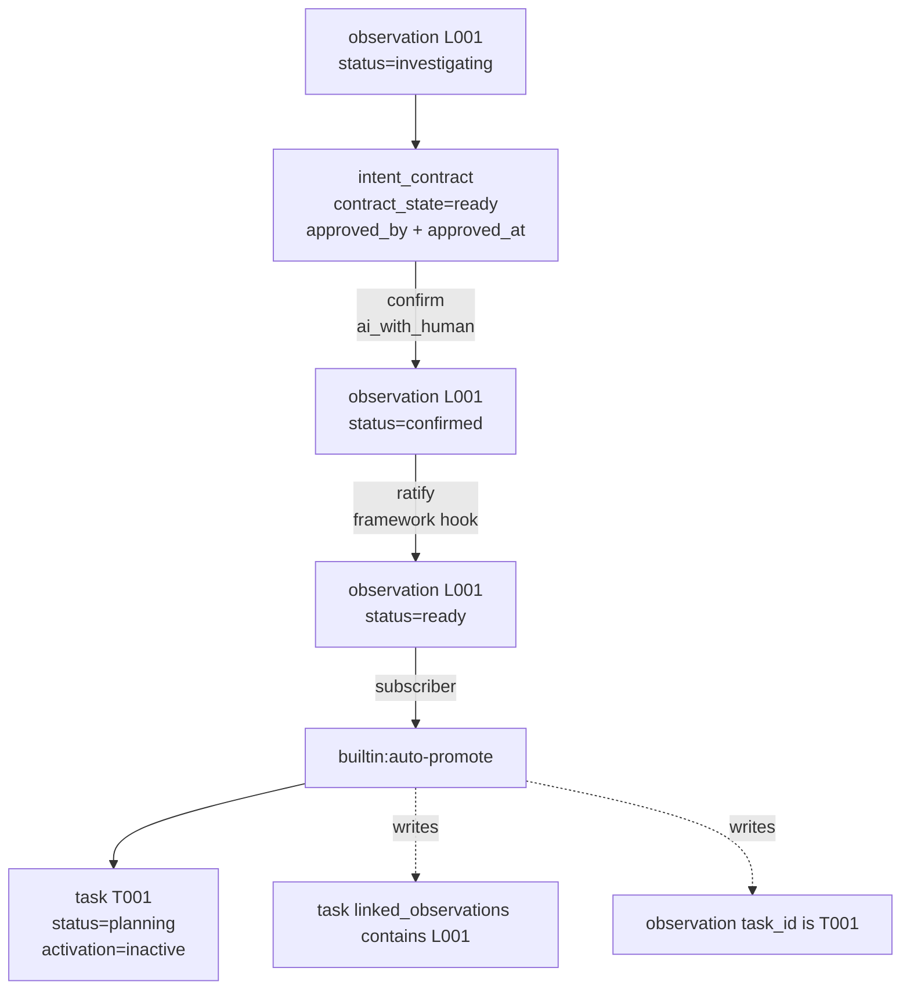
```mermaid
flowchart TD
    OBS[observation L001<br/>status=investigating]
    CONTRACT[intent_contract<br/>contract_state=ready<br/>approved_by + approved_at]
    CONFIRMED[observation L001<br/>status=confirmed]
    READY[observation L001<br/>status=ready]
    PROMOTE[builtin:auto-promote]
    TASK[task T001<br/>status=planning<br/>activation=inactive]

    OBS --> CONTRACT
    CONTRACT -->|confirm<br/>ai_with_human| CONFIRMED
    CONFIRMED -->|ratify<br/>framework hook| READY
    READY -->|subscriber| PROMOTE
    PROMOTE --> TASK
    PROMOTE -.->|writes| TASK_LINK[task linked_observations contains L001]
    PROMOTE -.->|writes| OBS_LINK[observation task_id is T001]
```

## Task Lifecycle

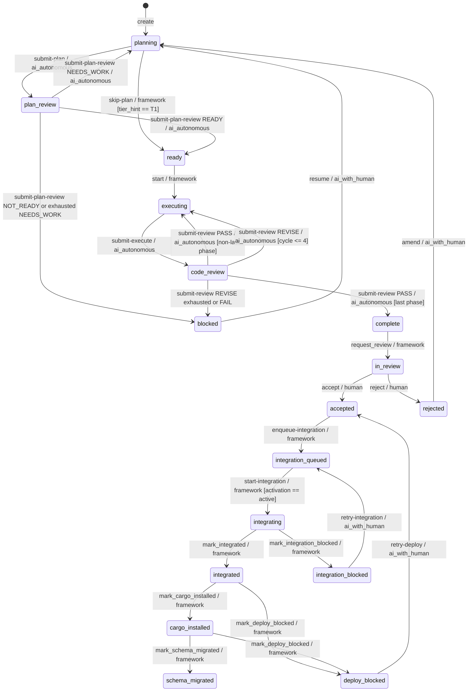
```mermaid
stateDiagram-v2
    [*] --> planning: create

    planning --> plan_review: submit-plan / ai_autonomous
    planning --> ready: skip-plan / framework [tier_hint == T1]

    plan_review --> ready: submit-plan-review READY / ai_autonomous
    plan_review --> planning: submit-plan-review NEEDS_WORK / ai_autonomous
    plan_review --> blocked: submit-plan-review NOT_READY or exhausted NEEDS_WORK

    ready --> executing: start / framework
    executing --> code_review: submit-execute / ai_autonomous

    code_review --> executing: submit-review PASS / ai_autonomous [non-last phase]
    code_review --> executing: submit-review REVISE / ai_autonomous [cycle <= 4]
    code_review --> blocked: submit-review REVISE exhausted or FAIL
    code_review --> complete: submit-review PASS / ai_autonomous [last phase]

    complete --> in_review: request_review / framework
    in_review --> accepted: accept / human
    in_review --> rejected: reject / human
    rejected --> planning: amend / ai_with_human
    blocked --> planning: resume / ai_with_human

    accepted --> integration_queued: enqueue-integration / framework
    integration_queued --> integrating: start-integration / framework [activation == active]
    integrating --> integrated: mark_integrated / framework
    integrating --> integration_blocked: mark_integration_blocked / framework
    integration_blocked --> integration_queued: retry-integration / ai_with_human

    integrated --> cargo_installed: mark_cargo_installed / framework
    integrated --> deploy_blocked: mark_deploy_blocked / framework
    cargo_installed --> schema_migrated: mark_schema_migrated / framework
    cargo_installed --> deploy_blocked: mark_deploy_blocked / framework
    deploy_blocked --> accepted: retry-deploy / ai_with_human
```

## Activation Gate

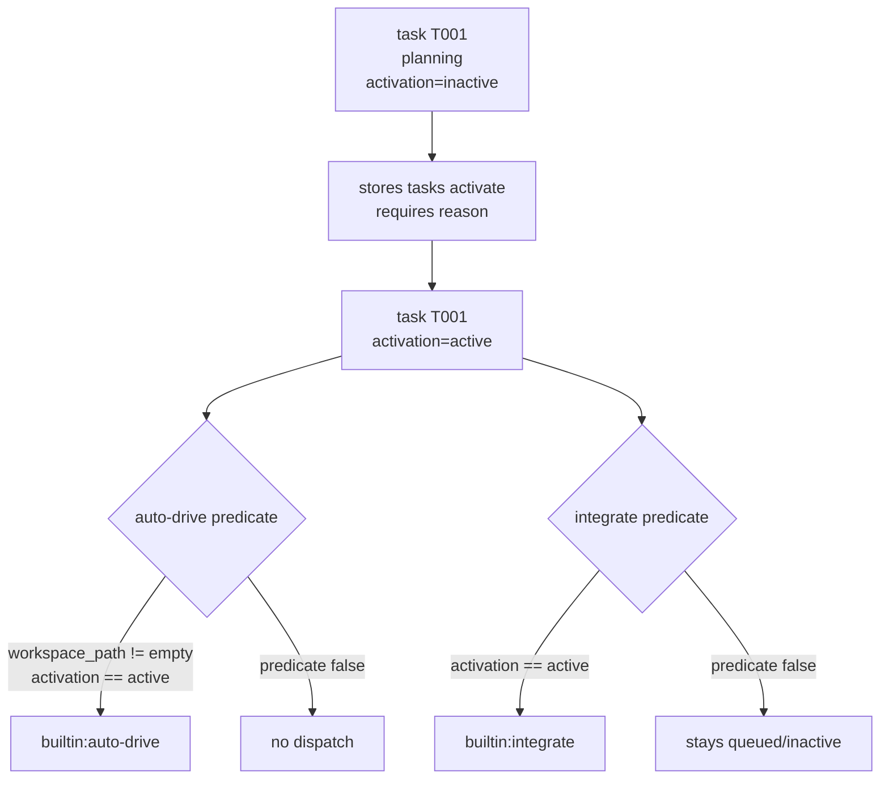
```mermaid
flowchart TD
    T[task T001<br/>planning<br/>activation=inactive]
    ACTIVATE[stores tasks activate<br/>requires reason]
    ACTIVE[task T001<br/>activation=active]
    DRIVE{auto-drive predicate}
    INTEGRATE{integrate predicate}

    T --> ACTIVATE --> ACTIVE

    ACTIVE --> DRIVE
    DRIVE -->|workspace_path != empty<br/>activation == active| AUTO_DRIVE[builtin:auto-drive]
    DRIVE -->|predicate false| NO_DRIVE[no dispatch]

    ACTIVE --> INTEGRATE
    INTEGRATE -->|activation == active| AUTO_INTEGRATE[builtin:integrate]
    INTEGRATE -->|predicate false| NO_INTEGRATE[stays queued/inactive]
```

## Task Success Resolves Observations

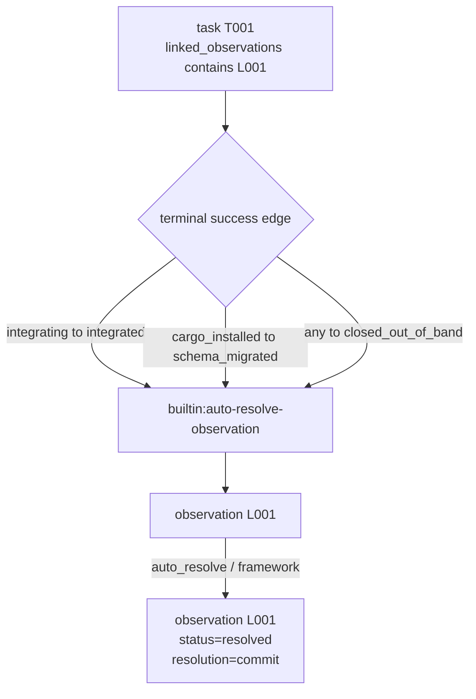
```mermaid
flowchart TD
    TASK[task T001<br/>linked_observations contains L001]
    SUCCESS{terminal success edge}
    RESOLVER[builtin:auto-resolve-observation]
    OBS[observation L001]
    RESOLVED[observation L001<br/>status=resolved<br/>resolution=commit]

    TASK --> SUCCESS
    SUCCESS -->|integrating to integrated| RESOLVER
    SUCCESS -->|cargo_installed to schema_migrated| RESOLVER
    SUCCESS -->|any to closed_out_of_band| RESOLVER
    RESOLVER --> OBS
    OBS -->|auto_resolve / framework| RESOLVED
```

## Architecture Review Gate

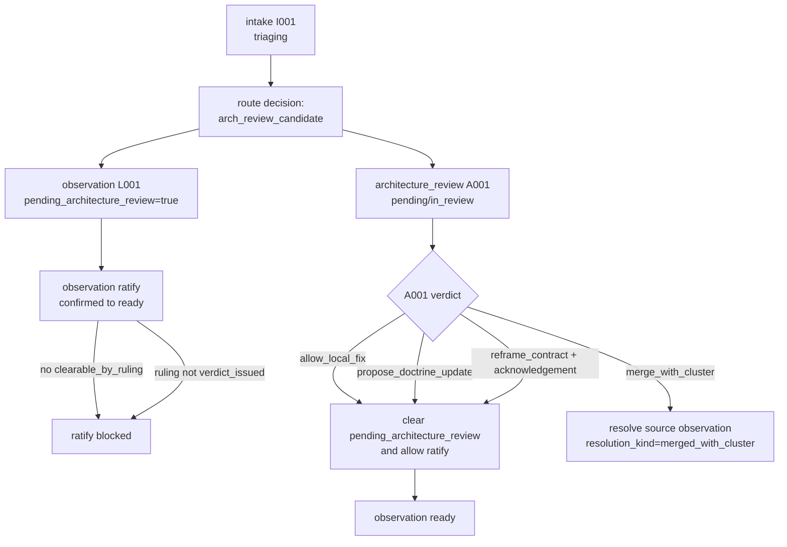
```mermaid
flowchart TD
    INTAKE[intake I001<br/>triaging]
    ROUTE[route decision:<br/>arch_review_candidate]
    OBS[observation L001<br/>pending_architecture_review=true]
    ARCH[architecture_review A001<br/>pending/in_review]
    VERDICT{A001 verdict}
    RATIFY[observation ratify<br/>confirmed to ready]
    BLOCK[ratify blocked]
    CLEAR[clear pending_architecture_review<br/>and allow ratify]
    MERGE[resolve source observation<br/>resolution_kind=merged_with_cluster]

    INTAKE --> ROUTE
    ROUTE --> OBS
    ROUTE --> ARCH
    ARCH --> VERDICT

    OBS --> RATIFY
    RATIFY -->|no clearable_by_ruling| BLOCK
    RATIFY -->|ruling not verdict_issued| BLOCK
    VERDICT -->|allow_local_fix| CLEAR
    VERDICT -->|propose_doctrine_update| CLEAR
    VERDICT -->|reframe_contract + acknowledgement| CLEAR
    VERDICT -->|merge_with_cluster| MERGE
    CLEAR --> READY[observation ready]
```

## Example: Observation Filed To Completed

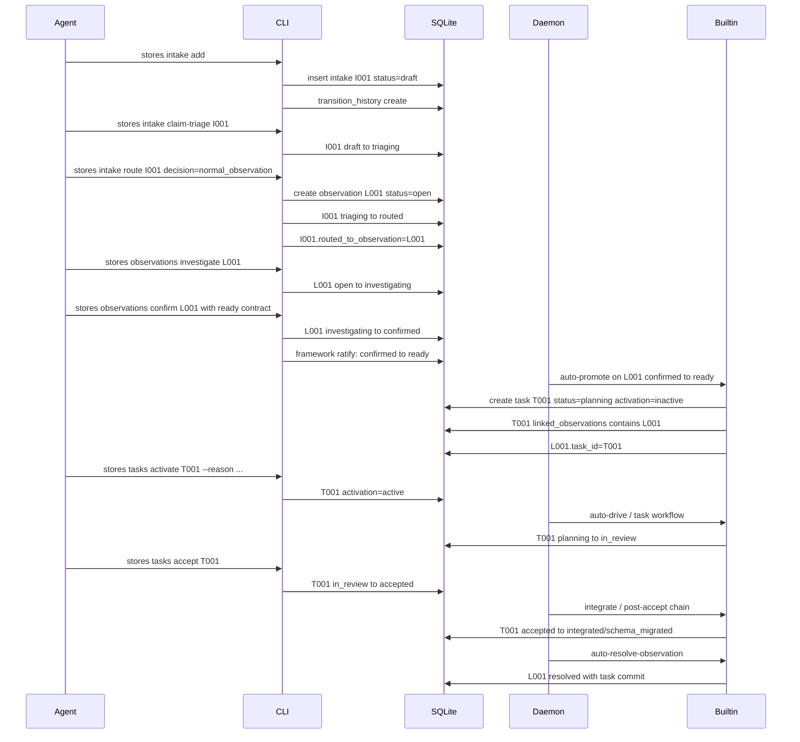
```mermaid
sequenceDiagram
    participant Agent
    participant CLI
    participant DB as SQLite
    participant Daemon
    participant Builtin

    Agent->>CLI: stores intake add
    CLI->>DB: insert intake I001 status=draft
    CLI->>DB: transition_history create

    Agent->>CLI: stores intake claim-triage I001
    CLI->>DB: I001 draft to triaging

    Agent->>CLI: stores intake route I001 decision=normal_observation
    CLI->>DB: create observation L001 status=open
    CLI->>DB: I001 triaging to routed
    CLI->>DB: I001.routed_to_observation=L001

    Agent->>CLI: stores observations investigate L001
    CLI->>DB: L001 open to investigating

    Agent->>CLI: stores observations confirm L001 with ready contract
    CLI->>DB: L001 investigating to confirmed
    CLI->>DB: framework ratify: confirmed to ready

    Daemon->>Builtin: auto-promote on L001 confirmed to ready
    Builtin->>DB: create task T001 status=planning activation=inactive
    Builtin->>DB: T001 linked_observations contains L001
    Builtin->>DB: L001.task_id=T001

    Agent->>CLI: stores tasks activate T001 --reason ...
    CLI->>DB: T001 activation=active

    Daemon->>Builtin: auto-drive / task workflow
    Builtin->>DB: T001 planning to in_review

    Agent->>CLI: stores tasks accept T001
    CLI->>DB: T001 in_review to accepted

    Daemon->>Builtin: integrate / post-accept chain
    Builtin->>DB: T001 accepted to integrated/schema_migrated

    Daemon->>Builtin: auto-resolve-observation
    Builtin->>DB: L001 resolved with task commit
```

## Relationship Fields

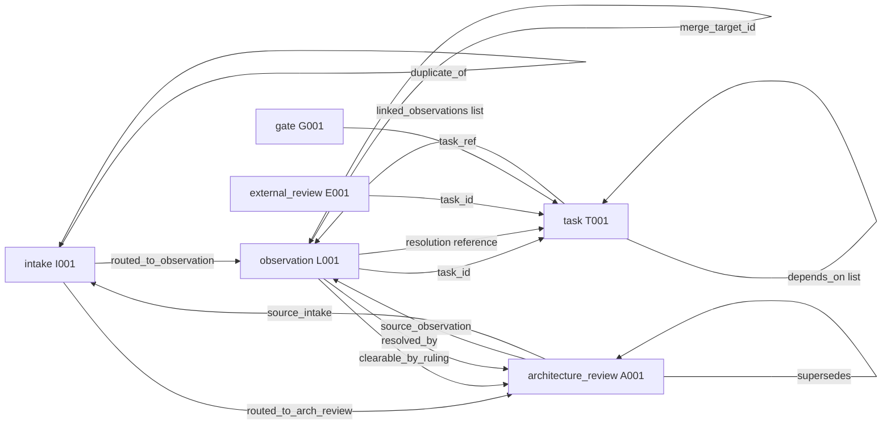
```mermaid
flowchart LR
    I[intake I001]
    L[observation L001]
    T[task T001]
    A[architecture_review A001]
    E[external_review E001]
    G[gate G001]

    I -- duplicate_of --> I
    I -- routed_to_observation --> L
    I -- routed_to_arch_review --> A

    L -- task_id --> T
    L -- clearable_by_ruling --> A
    L -- resolved_by --> A
    L -- merge_target_id --> L
    L -- resolution reference --> T

    T -- linked_observations list --> L
    T -- depends_on list --> T

    A -- source_observation --> L
    A -- source_intake --> I
    A -- supersedes --> A

    E -- task_id --> T
    G -- task_ref --> T
```

## Simplified Proposal

The current system has useful primitives, but too many ingress paths, implicit hooks,
and cross-store side effects. A simpler target shape is to make every new signal pass
through one front door, make promotion explicit, and keep automation behind a small
number of visible queue states.

### Simplified Big Picture

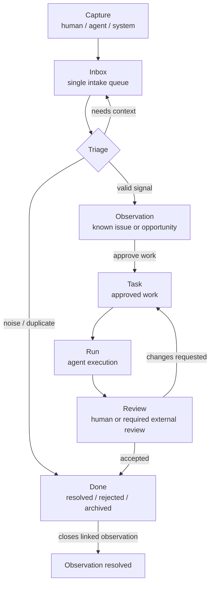
```mermaid
flowchart TD
    CAPTURE[Capture<br/>human / agent / system]
    INBOX[Inbox<br/>single intake queue]
    TRIAGE{Triage}
    OBS[Observation<br/>known issue or opportunity]
    TASK[Task<br/>approved work]
    RUN[Run<br/>agent execution]
    REVIEW[Review<br/>human or required external review]
    DONE[Done<br/>resolved / rejected / archived]

    CAPTURE --> INBOX
    INBOX --> TRIAGE
    TRIAGE -->|noise / duplicate| DONE
    TRIAGE -->|needs context| INBOX
    TRIAGE -->|valid signal| OBS
    OBS -->|approve work| TASK
    TASK --> RUN
    RUN --> REVIEW
    REVIEW -->|changes requested| TASK
    REVIEW -->|accepted| DONE
    DONE -->|closes linked observation| OBS_DONE[Observation resolved]
```

### Fewer Stores

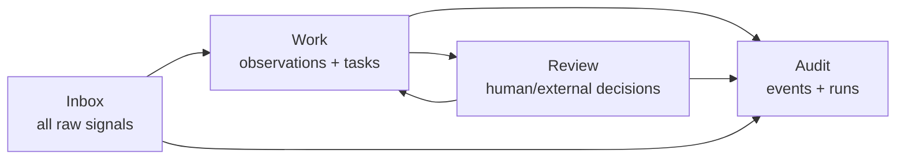
```mermaid
flowchart LR
    INBOX[Inbox<br/>all raw signals]
    WORK[Work<br/>observations + tasks]
    REVIEW[Review<br/>human/external decisions]
    AUDIT[Audit<br/>events + runs]

    INBOX --> WORK
    WORK --> REVIEW
    REVIEW --> WORK
    WORK --> AUDIT
    REVIEW --> AUDIT
    INBOX --> AUDIT
```

In this model:

- `intake` becomes the only filing path.
- `observations` and `tasks` can remain separate tables internally, but the user-facing model is one `Work` lane.
- `architecture_reviews`, `external_reviews`, and `gate` become typed review/gate records rather than separate lifecycle worlds.
- `transition_history` and `agent_runs` stay as audit infrastructure.

### One Filing Path

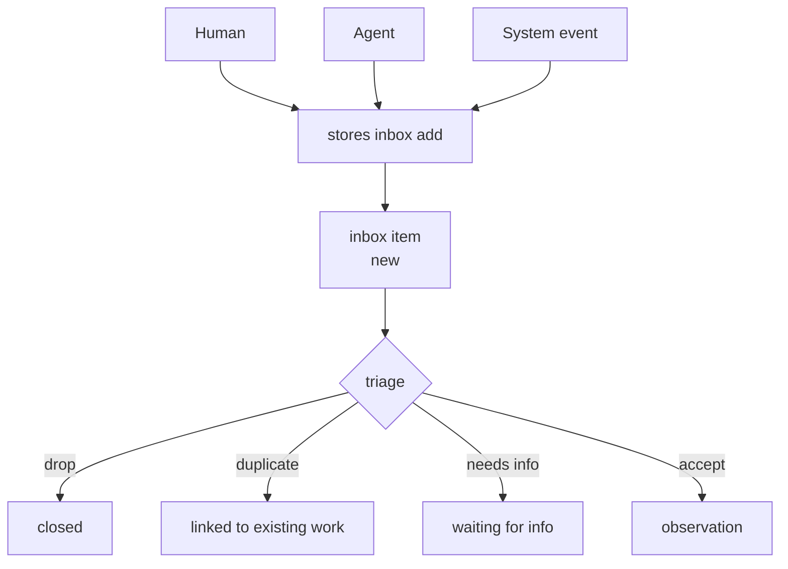
```mermaid
flowchart TD
    HUMAN[Human]
    AGENT[Agent]
    SYSTEM[System event]

    HUMAN --> FILE[stores inbox add]
    AGENT --> FILE
    SYSTEM --> FILE

    FILE --> INBOX[inbox item<br/>new]
    INBOX --> TRIAGE{triage}
    TRIAGE -->|drop| CLOSED[closed]
    TRIAGE -->|duplicate| LINKED[linked to existing work]
    TRIAGE -->|needs info| WAITING[waiting for info]
    TRIAGE -->|accept| OBS[observation]
```

The escape hatch can still exist, but it should be rare and loud:

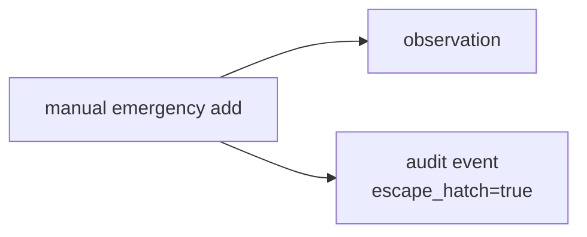
```mermaid
flowchart LR
    ESCAPE[manual emergency add]
    OBS[observation]
    AUDIT[audit event<br/>escape_hatch=true]

    ESCAPE --> OBS
    ESCAPE --> AUDIT
```

### Simplified Observation States

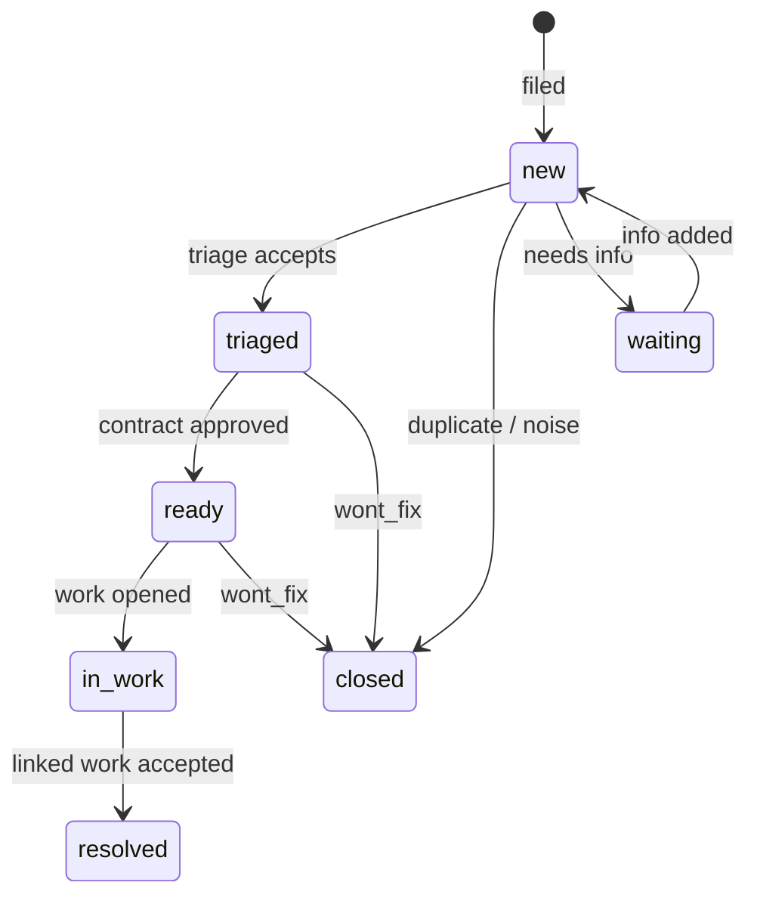
```mermaid
stateDiagram-v2
    state "new" as obs_new
    state "triaged" as obs_triaged
    state "waiting" as obs_waiting
    state "ready" as obs_ready
    state "in_work" as obs_in_work
    state "resolved" as obs_resolved
    state "closed" as obs_closed

    [*] --> obs_new: filed
    obs_new --> obs_triaged: triage accepts
    obs_new --> obs_closed: duplicate / noise
    obs_new --> obs_waiting: needs info
    obs_waiting --> obs_new: info added

    obs_triaged --> obs_ready: contract approved
    obs_ready --> obs_in_work: work opened
    obs_in_work --> obs_resolved: linked work accepted
    obs_triaged --> obs_closed: wont_fix
    obs_ready --> obs_closed: wont_fix
```

This collapses the current observation lifecycle:

```text
open / needs_investigation / investigating / investigated / confirmed / ready
```

into:

```text
new / triaged / waiting / ready / in_work / resolved / closed
```

### Simplified Task States

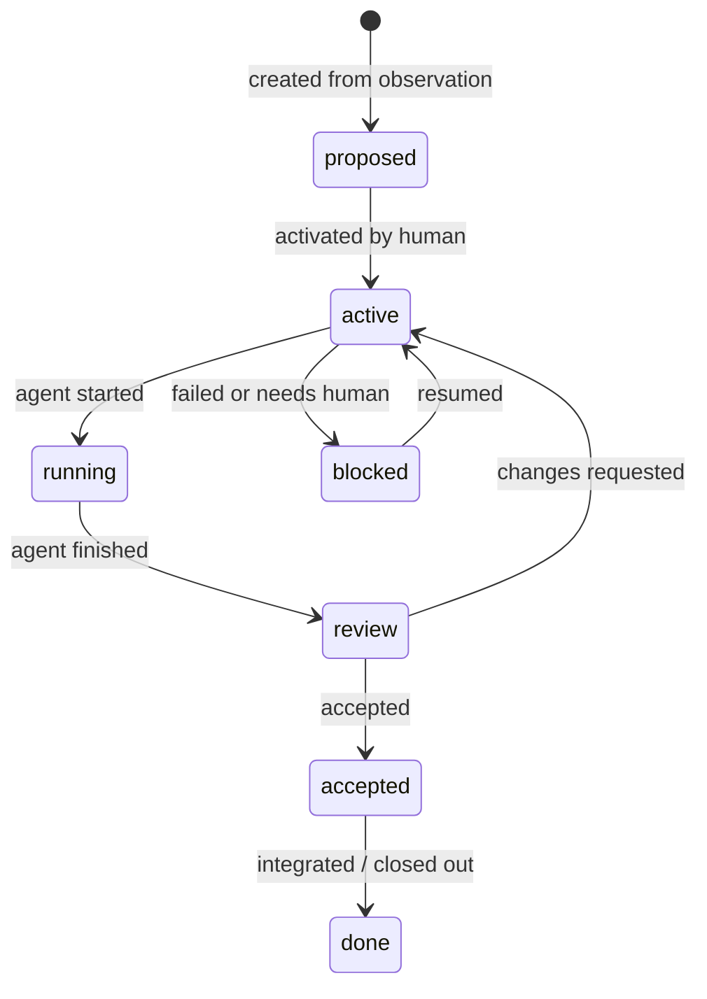
```mermaid
stateDiagram-v2
    state "proposed" as task_proposed
    state "active" as task_active
    state "running" as task_running
    state "review" as task_review
    state "accepted" as task_accepted
    state "blocked" as task_blocked
    state "done" as task_done

    [*] --> task_proposed: created from observation
    task_proposed --> task_active: activated by human
    task_active --> task_running: agent started
    task_running --> task_review: agent finished
    task_review --> task_active: changes requested
    task_review --> task_accepted: accepted
    task_active --> task_blocked: failed or needs human
    task_blocked --> task_active: resumed
    task_accepted --> task_done: integrated / closed out
```

This collapses:

```text
planning / plan_review / ready / executing / code_review / complete /
in_review / accepted / integration_queued / integrating / integrated /
cargo_installed / schema_migrated / deploy_blocked / integration_blocked
```

into:

```text
proposed / active / running / review / accepted / blocked / done
```

Detailed phase, review, integration, and deploy facts can become fields or child events,
not top-level lifecycle states.

### Explicit Automation Queue

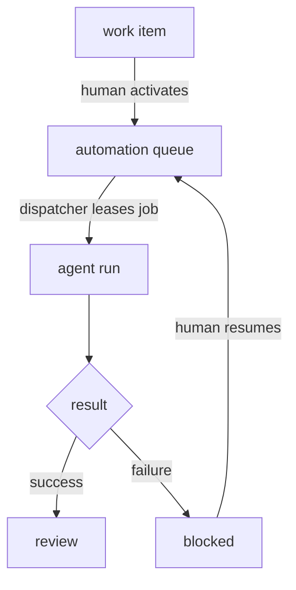
```mermaid
flowchart TD
    WORK[work item]
    QUEUE[automation queue]
    RUNNING[agent run]
    RESULT{result}
    REVIEW[review]
    BLOCKED[blocked]

    WORK -->|human activates| QUEUE
    QUEUE -->|dispatcher leases job| RUNNING
    RUNNING --> RESULT
    RESULT -->|success| REVIEW
    RESULT -->|failure| BLOCKED
    BLOCKED -->|human resumes| QUEUE
```

Instead of many subscribers firing from many transitions, most automation can be:

```text
activated work -> queue -> run -> result -> review/block
```

Subscribers still exist, but they are implementation details behind the queue.

### Simplified Gate Model

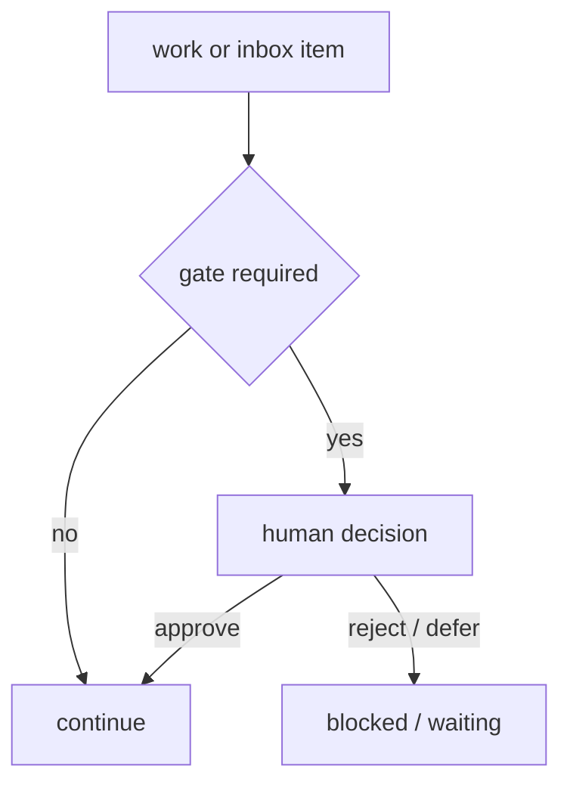
```mermaid
flowchart TD
    ITEM[work or inbox item]
    GATE{gate required}
    HUMAN[human decision]
    CONTINUE[continue]
    BLOCK[blocked / waiting]

    ITEM --> GATE
    GATE -->|no| CONTINUE
    GATE -->|yes| HUMAN
    HUMAN -->|approve| CONTINUE
    HUMAN -->|reject / defer| BLOCK
```

Rather than each gate having a separate lifecycle and store-specific behavior, gates can
be attached to the item they block:

```text
item.gates:
  type
  reason
  status: pending | approved | rejected | deferred
  decided_by
  decided_at
```

### Simplified Relationships

```mermaid
flowchart LR
    INBOX[inbox item]
    OBS[observation]
    TASK[task]
    REVIEW[review/gate]
    EVENT[audit event]

    INBOX -->|creates or links| OBS
    OBS -->|opens| TASK
    TASK -->|has| REVIEW
    REVIEW -->|decides| TASK
    TASK -->|resolves| OBS
    INBOX --> EVENT
    OBS --> EVENT
    TASK --> EVENT
    REVIEW --> EVENT
```

The key simplification is one dominant chain:

```text
Inbox -> Observation -> Task -> Review -> Done -> Observation resolved
```

Everything else should hang off that chain as metadata, gates, or audit events.
