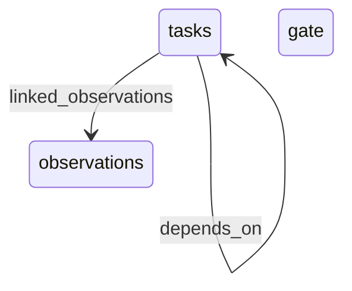
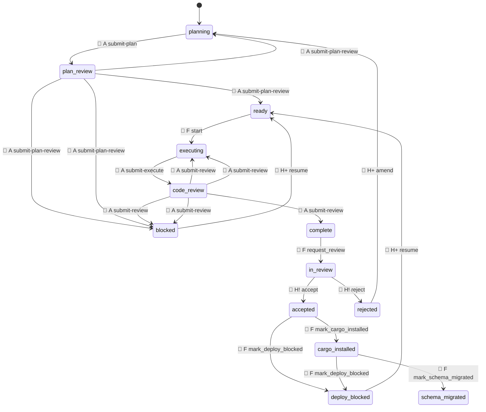
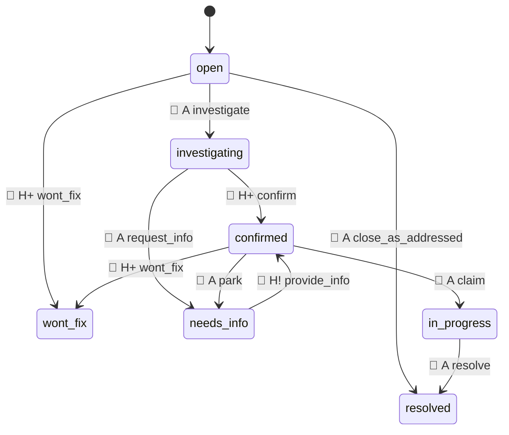
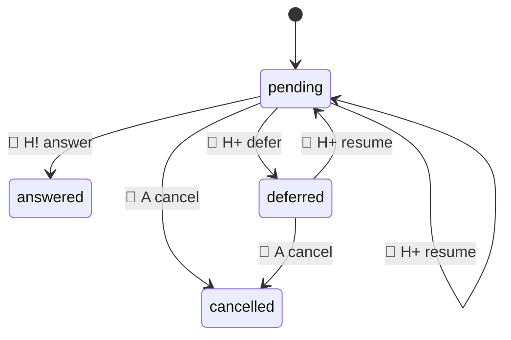
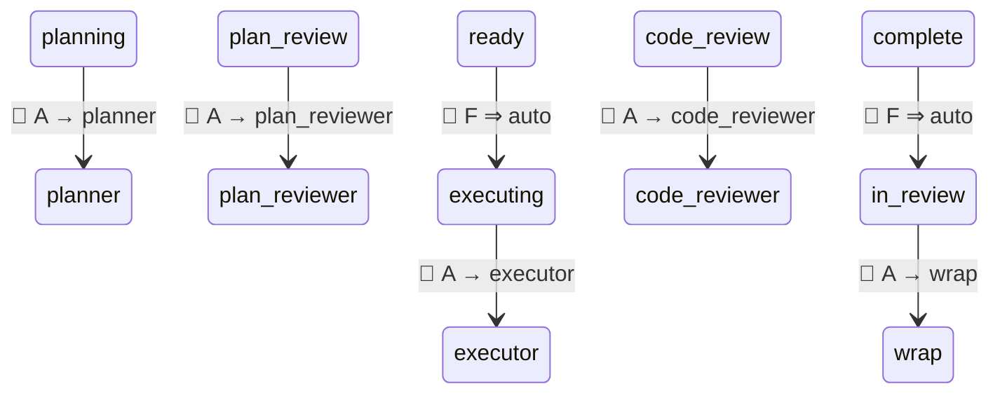

## Z0: cross-store soft-FKs

```mermaid
stateDiagram-v2
  state "tasks" as tasks
  state "observations" as observations
  state "gate" as gate
  tasks --> tasks : depends_on
  tasks --> observations : linked_observations
```

---

## Z1: tasks state machine

```mermaid
stateDiagram-v2
  [*] --> planning
  planning --> plan_review :  A submit-plan
  plan_review --> ready :  A submit-plan-review
  plan_review --> planning :  A submit-plan-review
  plan_review --> blocked :  A submit-plan-review
  plan_review --> blocked :  A submit-plan-review
  ready --> executing :  F start
  executing --> code_review :  A submit-execute
  code_review --> executing :  A submit-review
  code_review --> complete :  A submit-review
  code_review --> executing :  A submit-review
  code_review --> blocked :  A submit-review
  code_review --> blocked :  A submit-review
  blocked --> ready :  H+ resume
  accepted --> deploy_blocked :  F mark_deploy_blocked
  deploy_blocked --> ready :  H+ resume
  accepted --> cargo_installed :  F mark_cargo_installed
  cargo_installed --> schema_migrated :  F mark_schema_migrated
  cargo_installed --> deploy_blocked :  F mark_deploy_blocked
  complete --> in_review :  F request_review
  in_review --> accepted :  H! accept
  in_review --> rejected :  H! reject
  rejected --> planning :  H+ amend
```

---

## Z1: observations state machine

```mermaid
stateDiagram-v2
  [*] --> open
  open --> investigating :  A investigate
  open --> wont_fix :  H+ wont_fix
  open --> resolved :  A close_as_addressed
  investigating --> confirmed :  H+ confirm
  investigating --> needs_info :  A request_info
  confirmed --> needs_info :  A park
  needs_info --> confirmed :  H! provide_info
  confirmed --> in_progress :  A claim
  in_progress --> resolved :  A resolve
  confirmed --> wont_fix :  H+ wont_fix
```

---

## Z1: gate state machine

```mermaid
stateDiagram-v2
  [*] --> pending
  pending --> answered :  H! answer
  pending --> cancelled :  A cancel
  deferred --> cancelled :  A cancel
  pending --> deferred :  H+ defer
  deferred --> pending :  H+ resume
  pending --> pending :  H+ resume
```

---

## Z2: tasks workflow firing order

```mermaid
stateDiagram-v2
  state "planner" as planning_role_0_planner
  planning --> planning_role_0_planner :  A → planner
  state "plan_reviewer" as plan_review_role_0_plan_reviewer
  plan_review --> plan_review_role_0_plan_reviewer :  A → plan_reviewer
  ready --> executing :  F ⇒ auto
  state "executor" as executing_role_0_executor
  executing --> executing_role_0_executor :  A → executor
  state "code_reviewer" as code_review_role_0_code_reviewer
  code_review --> code_review_role_0_code_reviewer :  A → code_reviewer
  complete --> in_review :  F ⇒ auto
  state "wrap" as in_review_role_0_wrap
  in_review --> in_review_role_0_wrap :  A → wrap
```

